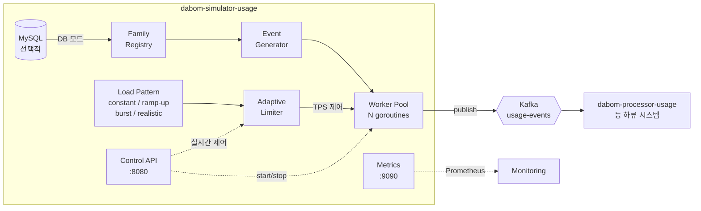

# dabom-simulator-usage

DABOM 플랫폼의 데이터 사용량 이벤트(`DATA_USAGE`)를 시뮬레이션하여 Kafka로 발행하는 부하 생성기.

하류 시스템(`dabom-processor-usage` 등)의 성능 테스트, 통합 검증, 데모 환경 구축을 목적으로 한다.
가족 그룹(Family) 단위로 구성원(Customer)의 사용량 이벤트를 생성하며, TPS 제어 · 다양한 부하 패턴 · HTTP API를 통한 실시간 조정을 지원한다.

## 목차

- [시스템 개요](#시스템-개요)
- [아키텍처](#아키텍처)
- [핵심 기능](#핵심-기능)
  - [이벤트 생성 엔진](#1-이벤트-생성-엔진)
  - [부하 패턴 제어](#2-부하-패턴-제어)
  - [워커 풀과 Kafka 발행](#3-워커-풀과-kafka-발행)
  - [HTTP 제어 API](#4-http-제어-api)
  - [Prometheus 메트릭](#5-prometheus-메트릭)
  - [DB 모드](#6-db-모드)
- [이벤트 메시지 스펙](#이벤트-메시지-스펙)
- [내부 데이터 분포](#내부-데이터-분포)
- [설정 레퍼런스](#설정-레퍼런스)
- [환경변수 오버라이드](#환경변수-오버라이드)
- [빌드 및 실행](#빌드-및-실행)
- [HTTP API 레퍼런스](#http-api-레퍼런스)
- [Prometheus 메트릭 레퍼런스](#prometheus-메트릭-레퍼런스)
- [프로젝트 구조](#프로젝트-구조)

---

## 시스템 개요



**기술 스택**: Go 1.24 · segmentio/kafka-go · golang.org/x/time/rate · prometheus/client_golang · go-sql-driver/mysql

---

## 아키텍처

시뮬레이터는 다음 5개의 내부 모듈로 구성된다.

| 모듈 | 패키지 | 역할 |
|---|---|---|
| **Config** | `internal/config` | YAML 설정 파일 로드 + 환경변수 오버라이드 |
| **Generator** | `internal/generator` | Family 레지스트리 관리 · 이벤트 생성 (가중 확률 분포 기반) |
| **Producer** | `internal/producer` | Kafka Producer · WorkerPool (N개 goroutine 병렬 발행) |
| **RateLimit** | `internal/ratelimit` | AdaptiveLimiter (런타임 TPS 변경) · 4종 부하 패턴 |
| **API** | `internal/api` | Simulator 오케스트레이터 · HTTP 제어 엔드포인트 |

### 초기화 흐름

```
main()
  ├─ config.Load(path)           # YAML 파싱 + 환경변수 오버라이드
  ├─ metrics.New()               # Prometheus 메트릭 레지스터
  ├─ producer.NewKafkaProducer() # kafka.Writer 초기화 (LZ4 압축, Hash 파티셔닝)
  ├─ api.InitSimulator()
  │    ├─ DB enabled?
  │    │    ├─ Yes → database.Connect() → LoadFamilies() → FamilyRegistryFromFamilies()
  │    │    └─ No  → FamilyRegistry(count, rng)   # 랜덤 생성
  │    ├─ EventGenerator(registry, rng)
  │    ├─ fixedTargets 설정 시 적용
  │    └─ reg.DumpToFile("family_registry.log")    # 검증용 덤프
  ├─ api.NewServer() → :8080 (제어 API)
  ├─ metrics.NewServer() → :9090 (메트릭)
  └─ sim.Start()                 # 자동 시작 → WorkerPool 가동
```

### Graceful Shutdown

SIGINT/SIGTERM 수신 시:
1. WorkerPool 중지 (모든 워커 goroutine 종료 대기)
2. Control API 서버 shutdown
3. Metrics 서버 shutdown
4. Kafka Producer close (내부 배치 flush)

---

## 핵심 기능

### 1. 이벤트 생성 엔진

`EventGenerator`는 매 호출마다 하나의 `EventEnvelope`을 생성한다.

**타겟 선택 전략**:
- **랜덤 모드** (기본): `FamilyRegistry`에서 균등 확률로 Family를 선택 → 해당 Family의 Member 중 1명을 균등 확률로 선택
- **고정 타겟 모드**: 설정된 `fixedTargets` 목록에서 균등 확률로 선택 (디버깅 · 특정 시나리오 재현용)

**이벤트 필드 생성**:
- `eventId`: UUID v4 (google/uuid)
- `eventType`: 항상 `"DATA_USAGE"`
- `timestamp`: 현재 시각, Java LocalDateTime 포맷 (`2006-01-02T15:04:05.000`, 타임존 없음)
- `appId`: 앱 카테고리별 가중 확률로 선택 (아래 [분포표](#내부-데이터-분포) 참조)
- `bytesUsed`: 선택된 앱 카테고리의 min~max 범위 내 균등 분포
- `deviceId`: 12종 실제 디바이스 모델명 기반 (`device_galaxy_s24` 등)
- `networkType`: 4G(50%) / WIFI(30%) / 5G(20%)

### 2. 부하 패턴 제어

`AdaptiveLimiter`는 `golang.org/x/time/rate.Limiter`를 래핑하여 런타임 TPS 변경을 지원한다.
Burst 크기는 `TPS / 10` (최소 1)으로 자동 설정된다.

4종의 `LoadPattern` 구현:

| 패턴 | 동작 | 조정 주기 |
|---|---|---|
| **constant** | 고정 TPS 유지 | - |
| **ramp-up** | `startTps` → `targetTps` 선형 증가 → 목표 도달 후 유지 | 100ms |
| **burst** | `baseTps` 유지 → `intervalSeconds` 간격으로 `burstTps` 급등 → `burstDurationSeconds` 후 복귀 | 설정 간격 |
| **realistic** | 시간대별 배수 적용: 새벽(0.2x) ~ 저녁(1.8x) | 10초 |

**Realistic 패턴 시간대별 배수**:

| 시간대 | 배수 | 예시 (BaseTPS=5000) |
|---|---|---|
| 00:00 ~ 06:00 | 0.2x | 1,000 TPS |
| 06:00 ~ 09:00 | 0.8x | 4,000 TPS |
| 09:00 ~ 12:00 | 1.0x | 5,000 TPS |
| 12:00 ~ 14:00 | 1.5x | 7,500 TPS |
| 14:00 ~ 18:00 | 1.0x | 5,000 TPS |
| 18:00 ~ 22:00 | 1.8x | 9,000 TPS |
| 22:00 ~ 24:00 | 1.2x | 6,000 TPS |

**수동 버스트**: HTTP API로 즉시 트리거 가능. 지정 시간 동안 TPS를 높인 뒤 이전 값으로 자동 복귀.

### 3. 워커 풀과 Kafka 발행

`WorkerPool`은 N개의 goroutine이 병렬로 이벤트를 생성·발행한다.

**동작 루프** (각 워커):
```
loop:
  limiter.Wait(ctx)          # TPS 제한 — 토큰 획득까지 대기
  event = generator.Generate()
  data  = json.Marshal(event)
  producer.Publish(key=familyId, value=data)
```

- **워커 수**: 설정의 `workerCount`. `0`이면 `runtime.NumCPU() * 2` 자동 설정.
- **파티션 키**: `familyId` (문자열 변환) → Kafka Hash 파티셔너가 동일 Family의 이벤트를 같은 파티션으로 라우팅
- **Kafka Writer 설정**: LZ4 압축 · 동기 발행 (`Async: false`) · 배치 크기 64KB · linger 5ms

### 4. HTTP 제어 API

`:8080`에서 제공. 시뮬레이터 실행 중 TPS · 모드 · 타겟을 실시간 변경할 수 있다.

| Method | Path | 설명 |
|---|---|---|
| `GET` | `/health` | 헬스 체크 |
| `GET` | `/status` | 상태 조회 (running, mode, tps, published/failed 카운트, uptime) |
| `POST` | `/control/start` | 시뮬레이터 시작 |
| `POST` | `/control/stop` | 시뮬레이터 정지 |
| `POST` | `/control/burst` | 수동 버스트 트리거 |
| `PUT` | `/config/tps` | TPS 변경 |
| `PUT` | `/config/mode` | 부하 패턴 변경 |
| `PUT` | `/config/burst` | 버스트 파라미터 변경 |
| `PUT` | `/config/fixed-targets` | 고정 타겟 설정 |
| `DELETE` | `/config/fixed-targets` | 고정 타겟 해제 (랜덤 모드 복귀) |

### 5. Prometheus 메트릭

`:9090/metrics`에서 수집. 10종의 메트릭을 제공한다.

### 6. DB 모드

`database.enabled: true` 시 MySQL에서 실제 `family` + `family_member` + `customer` 테이블을 JOIN 조회하여 Family/Customer 매핑을 구성한다.

- soft-delete된 레코드(`deleted_at IS NOT NULL`)는 제외
- DB 연결 실패 또는 데이터 없음 시 랜덤 생성 모드로 자동 fallback (1,000개 Family)

---

## 이벤트 메시지 스펙

Kafka 토픽 `usage-events`로 발행되는 JSON 메시지.
하류 시스템(`dabom-processor-usage`)의 `EventEnvelope<UsagePayload>` Java 레코드와 호환된다.

```json
{
  "eventId": "a1b2c3d4-e5f6-7890-abcd-ef1234567890",
  "eventType": "DATA_USAGE",
  "timestamp": "2025-01-15T14:30:22.123",
  "payload": {
    "familyId": 100042,
    "customerId": 200187,
    "appId": "com.youtube.app",
    "bytesUsed": 5242880,
    "metadata": {
      "deviceId": "device_galaxy_s24",
      "networkType": "5G"
    }
  }
}
```

| 필드 | 타입 | 설명 |
|---|---|---|
| `eventId` | string (UUID v4) | 이벤트 고유 식별자 |
| `eventType` | string | 항상 `"DATA_USAGE"` |
| `timestamp` | string (LocalDateTime) | 이벤트 생성 시각. 타임존 없음 |
| `payload.familyId` | int64 | 가족 그룹 ID |
| `payload.customerId` | int64 | 고객(구성원) ID |
| `payload.appId` | string | 앱 패키지명 (예: `com.youtube.app`) |
| `payload.bytesUsed` | int64 | 사용 데이터량 (bytes) |
| `payload.metadata.deviceId` | string | 디바이스 식별자 |
| `payload.metadata.networkType` | string | 네트워크 유형 (`4G` / `5G` / `WIFI`) |

**Kafka 메시지 키**: `familyId` (문자열). 동일 Family의 이벤트는 같은 파티션으로 라우팅된다.

---

## 내부 데이터 분포

### 가족 규모 분포

| 구성원 수 | 확률 |
|---|---|
| 2명 | 15% |
| 3명 | 25% |
| 4명 | 40% |
| 5명 | 15% |
| 6~10명 | 5% (균등) |

### 앱 카테고리별 분포

| 카테고리 | 앱 목록 | 선택 확률 | 데이터 사용량 범위 |
|---|---|---|---|
| **video** | `com.youtube.app`, `com.netflix.app` | 30% | 100 MB ~ 500 MB |
| **sns** | `com.instagram.app`, `com.tiktok.app` | 25% | 20 MB ~ 150 MB |
| **messenger** | `com.kakao.talk`, `com.line.app` | 20% | ~1 MB ~ 20 MB |
| **game** | `com.nexon.game`, `com.netmarble.game` | 10% | 10 MB ~ 100 MB |
| **browser** | `com.chrome.browser`, `com.samsung.browser` | 10% | ~5 MB ~ 50 MB |
| **other** | `com.naver.map`, `com.weather.app` | 5% | ~500 KB ~ 10 MB |

### 네트워크 유형 분포

| 유형 | 확률 |
|---|---|
| 4G | 50% |
| WIFI | 30% |
| 5G | 20% |

### 디바이스 모델 풀 (12종, 균등 확률)

`pixel_9` · `pixel_8` · `pixel_7` · `galaxy_s24` · `galaxy_s23` · `galaxy_a54` · `galaxy_z_flip5` · `iphone_15` · `iphone_14` · `iphone_se` · `xperia_1_v` · `v60_thinq`

---

## 설정 레퍼런스

설정 파일은 `configs/` 디렉토리에 환경별로 존재한다.

| 파일 | 용도 | TPS | Family 수 |
|---|---|---|---|
| `config.dev.yaml` | 로컬 개발/테스트 | 100 | 1,000 |
| `config.yaml` | 기본/스테이징 | 5,000 | 250,000 |
| `config.prod.yaml` | 프로덕션 | 5,000 | 250,000 |

### 전체 설정 스키마

```yaml
kafka:
  brokers: ["localhost:9092"]     # Kafka 브로커 주소 목록
  topic: "usage-events"           # 발행 토픽명
  acks: 1                         # RequiredAcks (0=none, 1=leader, -1=all)
  batchSize: 65536                # 배치 크기 (bytes)
  lingerMs: 5                     # 배치 대기 시간 (ms)
  bufferMemory: 67108864          # 프로듀서 버퍼 메모리 (bytes)
  compressionType: "lz4"          # 압축 알고리즘
  maxBlockMs: 60000               # 버퍼 풀 시 최대 블로킹 시간 (ms)

database:
  enabled: false                  # true 시 DB 모드 활성화
  host: "localhost"
  port: 3306
  user: "root"
  password: ""
  dbName: "dabom"

simulation:
  mode: "constant"                # constant | ramp-up | burst | realistic
  tps: 100                        # 초당 이벤트 발행 수
  workerCount: 4                  # 0이면 CPU 코어 수 × 2

  families:
    count: 1000                   # 랜덤 생성 시 가족 수
    maxMembers: 6                 # (랜덤 생성 시 참조 — 실제 분포는 가중 확률 기반)

  rampUp:                         # mode=ramp-up 전용
    startTps: 10
    targetTps: 100
    durationSeconds: 30

  burst:                          # mode=burst 전용
    baseTps: 100
    burstTps: 500
    burstDurationSeconds: 5
    intervalSeconds: 30

  fixedTargets:                   # 설정 시 해당 ID들로만 이벤트 생성
    - familyId: 12345
      customerIds: [100001, 100002, 100003]

server:
  controlPort: 8080               # HTTP 제어 API
  metricsPort: 9090               # Prometheus 메트릭

logging:
  level: "info"                   # debug | info | warn | error
  format: "json"                  # json | text
```

---

## 환경변수 오버라이드

YAML 설정 파일을 로드한 뒤, 아래 환경변수가 존재하면 해당 값으로 덮어쓴다.

| 환경변수 | 설정 경로 | 설명 |
|---|---|---|
| `KAFKA_BROKERS` | `kafka.brokers` | 쉼표 구분 브로커 목록 |
| `KAFKA_TOPIC` | `kafka.topic` | 토픽명 |
| `SIM_MODE` | `simulation.mode` | 부하 패턴 |
| `SIM_TPS` | `simulation.tps` | 목표 TPS |
| `SIM_WORKER_COUNT` | `simulation.workerCount` | 워커 수 |
| `CONTROL_PORT` | `server.controlPort` | 제어 API 포트 |
| `METRICS_PORT` | `server.metricsPort` | 메트릭 포트 |
| `LOG_LEVEL` | `logging.level` | 로그 레벨 |
| `DB_ENABLED` | `database.enabled` | `true` 시 DB 모드 |
| `DB_HOST` | `database.host` | MySQL 호스트 |
| `DB_PORT` | `database.port` | MySQL 포트 |
| `DB_USER` | `database.user` | MySQL 사용자 |
| `DB_PASSWORD` | `database.password` | MySQL 비밀번호 |
| `DB_NAME` | `database.dbName` | 데이터베이스명 |

---

## 빌드 및 실행

### 요구사항

- Go 1.24+
- Kafka 브로커 (Apache Kafka 3.x)
- MySQL (DB 모드 사용 시)
- Docker / Docker Compose (컨테이너 실행 시)

### 빌드

```bash
go build -o simulator-usage ./cmd/simulator/
```

### 로컬 실행

```bash
go run ./cmd/simulator -config configs/config.dev.yaml
```

### Docker Compose (Kafka 포함)

```bash
docker compose up -d
```

### Docker 단독 실행

```bash
docker build -t dabom-simulator-usage .
docker run --rm \
  -e KAFKA_BROKERS=host.docker.internal:9092 \
  -p 8080:8080 -p 9090:9090 \
  dabom-simulator-usage
```

### 테스트

```bash
go test ./...
```

---

## HTTP API 레퍼런스

### `GET /health`

헬스 체크.

```json
{"status": "ok"}
```

### `GET /status`

시뮬레이터 상태 조회.

```json
{
  "running": true,
  "mode": "constant",
  "currentTps": 100,
  "targetTps": 100,
  "totalPublished": 54321,
  "totalFailed": 0,
  "uptimeSeconds": 120,
  "fixedTargetCount": 0
}
```

### `POST /control/start`

시뮬레이터 시작. 이미 실행 중이면 `409 Conflict`.

### `POST /control/stop`

시뮬레이터 정지. 실행 중이 아니면 `409 Conflict`.

### `PUT /config/tps`

TPS 실시간 변경.

```bash
curl -X PUT http://localhost:8080/config/tps \
  -H "Content-Type: application/json" \
  -d '{"tps": 500}'
```

```json
{"previousTps": 100, "currentTps": 500, "message": "TPS updated"}
```

### `PUT /config/mode`

부하 패턴 변경. `mode`는 `constant` | `ramp-up` | `burst` | `realistic`.

```bash
# ramp-up 예시 — startTps, targetTps, durationSeconds 함께 전달
curl -X PUT http://localhost:8080/config/mode \
  -H "Content-Type: application/json" \
  -d '{"mode": "ramp-up", "startTps": 10, "targetTps": 500, "durationSeconds": 60}'
```

### `PUT /config/burst`

burst 패턴 파라미터 변경.

```bash
curl -X PUT http://localhost:8080/config/burst \
  -H "Content-Type: application/json" \
  -d '{"baseTps": 100, "burstTps": 500, "burstDurationSeconds": 5, "intervalSeconds": 30}'
```

### `POST /control/burst`

수동 버스트 트리거. 지정 시간 동안 TPS를 높인 뒤 자동 복귀. 시뮬레이터가 실행 중이어야 한다.

```bash
curl -X POST http://localhost:8080/control/burst \
  -H "Content-Type: application/json" \
  -d '{"count": 1000, "durationSeconds": 5}'
```

### `PUT /config/fixed-targets`

고정 타겟 설정. 설정 후 해당 Family/Customer로만 이벤트 생성.

```bash
curl -X PUT http://localhost:8080/config/fixed-targets \
  -H "Content-Type: application/json" \
  -d '{"targets": [{"familyId": 12345, "customerIds": [100001, 100002]}]}'
```

### `DELETE /config/fixed-targets`

고정 타겟 해제. 랜덤 모드로 복귀.

---

## Prometheus 메트릭 레퍼런스

`:9090/metrics`에서 수집.

| 메트릭 | 타입 | 설명 |
|---|---|---|
| `simulator_events_published_total` | Counter | 발행 성공 이벤트 수 |
| `simulator_events_failed_total` | Counter | 발행 실패 이벤트 수 |
| `simulator_events_published_bytes_total` | Counter | 발행된 총 바이트 수 |
| `simulator_current_tps` | Gauge | 설정된 TPS |
| `simulator_actual_tps` | Gauge | 실측 TPS (1초 윈도우) |
| `simulator_publish_latency_seconds` | Histogram | Kafka 발행 지연 시간 |
| `simulator_kafka_queue_length` | Gauge | Kafka 프로듀서 내부 큐 길이 |
| `simulator_kafka_delivery_errors_total` | Counter | Kafka 전송 오류 수 |
| `simulator_worker_active` | Gauge | 활성 워커 수 |
| `simulator_uptime_seconds` | Gauge | 가동 시간 (초) |

---

## 프로젝트 구조

```
cmd/simulator/main.go              # 엔트리포인트 — 초기화, 서버 기동, graceful shutdown
configs/
  config.dev.yaml                   # 개발용 (TPS 100, 가족 1,000)
  config.yaml                       # 기본/스테이징 (TPS 5,000, 가족 250,000)
  config.prod.yaml                  # 프로덕션
internal/
  api/
    server.go                       # Simulator 오케스트레이터 (상태 관리, 패턴 적용, 초기화)
    handlers.go                     # HTTP 핸들러 (10개 엔드포인트)
  config/
    config.go                       # YAML 파싱 + 환경변수 오버라이드
  database/
    database.go                     # MySQL 연결 · family/family_member JOIN 조회
  generator/
    types.go                        # EventEnvelope, UsagePayload, Family, FixedTarget 정의
    family.go                       # FamilyRegistry — 가족 생성/관리/랜덤 선택
    event.go                        # EventGenerator — 이벤트 조립 (타겟 선택 + 필드 생성)
    distribution.go                 # 가중 확률 분포 — 앱/네트워크/디바이스/데이터량
  metrics/
    prometheus.go                   # Prometheus 메트릭 등록 + HTTP 서버
  producer/
    producer.go                     # Producer 인터페이스
    kafka.go                        # KafkaProducer 구현 (segmentio/kafka-go)
    worker.go                       # WorkerPool — N goroutine 병렬 발행
    mock.go                         # 테스트용 Mock Producer
  ratelimit/
    limiter.go                      # AdaptiveLimiter — 런타임 TPS 변경 + 패턴 실행
    pattern.go                      # LoadPattern 인터페이스 + 4종 구현체
Dockerfile                          # 멀티스테이지 빌드 (golang:1.24-alpine → alpine:3.19)
docker-compose.yaml                 # Kafka (KRaft) + 시뮬레이터 통합 실행
```
